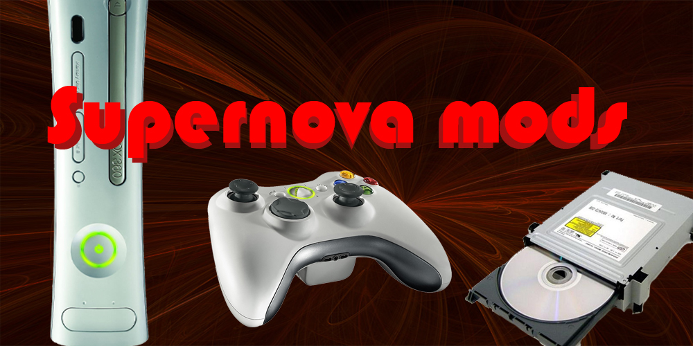



These projects reached a fully functional stage. There may still be work planned on them. Listed in reverse chronological order.

* * *

##21st Pool Lights
For my 21st birthday, I wanted to have lights integrated into the music and entertainment system. The goal was to control the existing lighting, as well as additionally purchased party lighting, from a central source in a way that would synchronise with and enhance whatever music was currently playing. After iterating through single device solutions on an arduino, and then a raspberry pi, I found that optimum performance would be found by running an analysis program on the PC which would control an arduino over a serial connection tunneled over USB, and then control the relays from that board.

It proved too challenging to write a beat extraction program on Windows with acceptable performance within the timeframe I had, so I found an open source solution running in processing. It came complete with a visualiser and easy hooks for adding GUI controls to the lighting. This was used as a base for the entire control program, with all commands sent from within processing. In the final implementation, it would pulse the pool lights every time the beat hit, as well as switching some fairy lights between two sets of bulbs on the beat. A halogen floodlight was also co-opted as a strobe light, activatable by keyboard commands.
To achieve this, relays were added in to the existing wiring for most of the devices, with the exception of the fairy lights, for which I designed and built an alternative control system from the one it was shipped with, keeping the power supply circuit only. Seen in the above pictures are the final effect from outside, taken during the event, and the electronics setup, with the ardiuno and its wiring to the relays, the replacement control board and the power supply to the fairy lights visible.

<video src="assets/lights.mp4" width="400" controls preload></video>
A video of the lighting effects. Unfortunately it was taken while it was raining, and does not capture the inner luminosity the pool displayed on the night. 

* * *

##Bluetooth Headset integrated into motorcycle helmet

Listen to music, change songs, receive/decline a call while flying along at 100km/h! This is one of the most practical, as it sees daily use. Very simple to implement, it’s an existing high end Bluetooth headset which had the buttons desoldered and moved to the outside of the helmet or replaced. A high capacity lithium battery designed for portable phone charging was also hacked into the system, resulting in a device that can go *3 months* of daily use without being recharged. It is a highly effective system, done for a fraction of the price of an off the shelf implementation, fully compatible with modern phone technology and custom shaped for the user. Still a work in progress, I am currently designing a 3d printed pod to contain all the electronics and switches which will sit on the outside of the helmet and have a simple 3.5mm jack interface to the speakers and microphone inside the helmet.

* * *

##Battery replacement power supply

Designed to replace AA batteries in high drain applications, an old IBM laptop power supply was modified to output 1.5V to a handcrafted aluminium battery blank. With the capacity to output up to ~10A this will melt solder with ease. A later minor revision added variable voltage control from 1.2V to 3V (replace rechargeable batteries or pairs of batteries with a jumper). This was one of the first circuits I designed myself.

* * *

##Xbox 'Hacking' Business

This is where I first started with electronics. My first foray into the field of practical electronics came very shortly after I saved up my pocket money to buy an Xbox 360. I realised that paying $100 every time I wanted a new game was not very economical so I made the investment to buy some basic equipment and hacked the DVD drive to play games burned onto DVD +R DL disks, writing the new firmware onto it via a SATA cable sticking out of the side of the family computer when my parents weren’t looking. My friends wanted the same thing, and then their friends, and thus SupernovaMods was born! I then started doing rapid fire mods on people’s controllers, where I installed a PIC controller that would press the trigger very rapidly for them while they held it down. Then there were full console hacks where the Gods of the Internet had figured out how to convince the xbox to run a custom firmware, and I deadbug built the chip programmers and JTAG access cables to enable this functionality too. It only ended when I realised how borderline illegal most of this was so I got a ‘real’ high school job at McDonald’s.

The business logo, some of the tools of the trade and a completed controller mod
 
 
 
 
 
