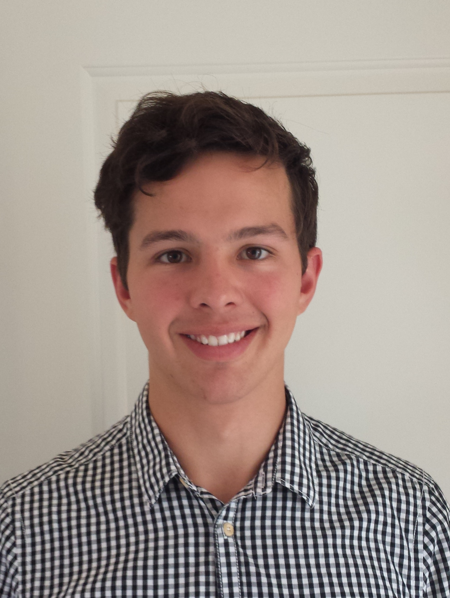



My name is Gareth Seddon. This site is contains a portfolio of the most interesting electronics and computer projects I have done in the last few years. It has been split up into

+ [Completed Projects](finished.html)
+ [Learning Experiences](unfinished.html)
+ [University Projects](uni.html)

* * *

##About Me

I have been interested in electronics and computers since a very young age. Our garage was littered with kits for various electronic gizmos, with my first experience being a clip together kit to make an AM radio reciever at about 7 years old. I also had a subscription to the Cybot magazine, and every fortnight a magazine would arrive in the post with some new parts for the robot you could put together over the years. I then got really deep into computers, with years worth of subscriptions to APC and other publications, before I got my first job in 2009 to build myself a gaming PC beast, based around the new Intel Nehalem i7 920. My interest has only grown since then, and I enrolled at Melbourne University to study a Bachelor of Science majoring in Electrical Systems, which I have recently graduated from. With this site I hope to show some of what I have worked on over the last few years.

