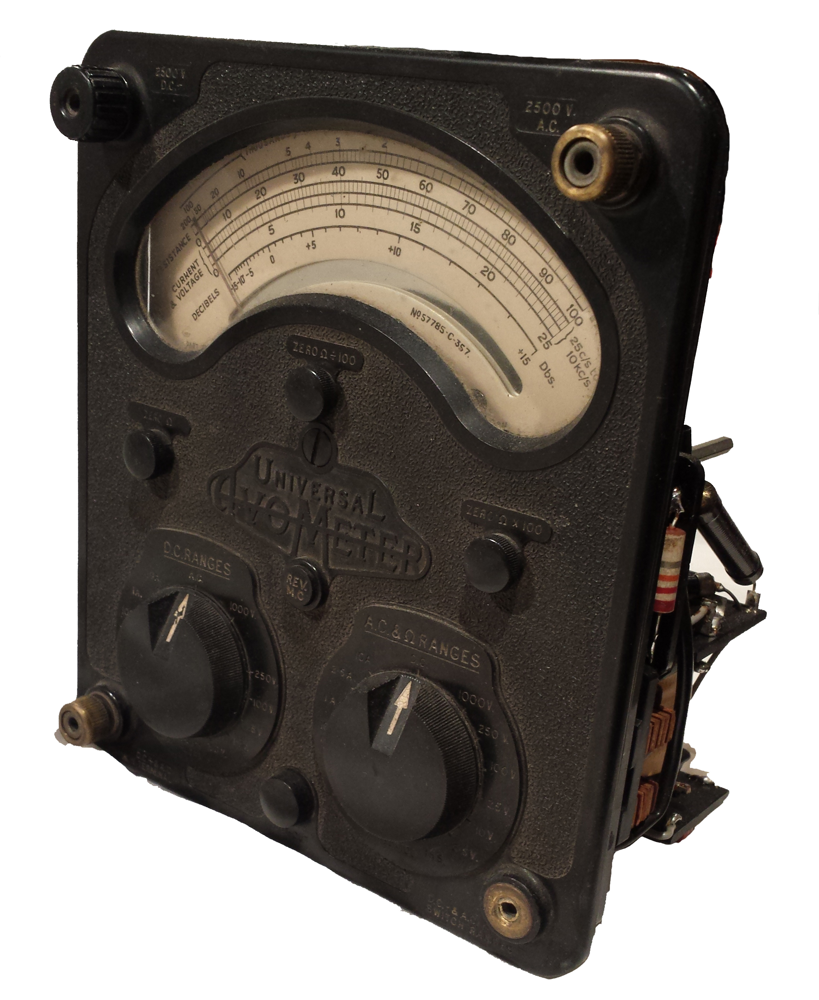
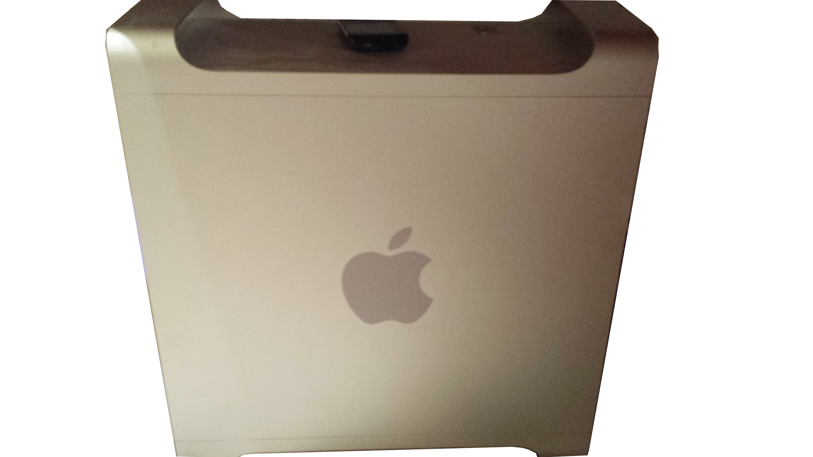



Some smaller or unfinished projects which were still invaluable learning experiences. Listed in reverse chronological order.

* * *

##1967 Vintage AVOmeter restoration

Completely disassembled and analysed for reasonable comprehension of its functionality. However, it was ultimately (and ironically) found that an expensive high accuracy multimeter was needed to find which resistor values had drifted over the years in order to replace them, allowing it to function as designed.

* * *

##Car Sound System

After purchasing a car the first thought was to see what could be improved. The obvious choice was a custom sound system, so secondhand components were sourced and installed. The only stock part of the system left is the aerial, with a subwoofer, subwoofer amp, 4x satellite speakers, a speaker amp, head unit and replacement wiring going into the car. This really taught me to respect high current electricity! I have since installed several sound systems in friends vehicles, in about 1/4 the time and with 1/4 the swearing.

* * *

##Custom PC Case

Why throw out a beautiful, elegant case when the contents get a bit outdated? As a summer project, an old PowerMac G5 was resurrected as a shiny new gaming rig. It was completely gutted and rebuilt to conform to ATX spec, while keeping the outside as stock as possible. Small touches such as a rewired and reused power button and LED complete the look. It still purrs along in daily use. Regular component upgrades means it’s well overdue for some loving cable management. As with sound systems, I enjoy building PCs and have assembled many for friends and family.

* * *

##3x3x3 LED cube

Programmable to display 3D shapes! Built in high school from instructions found on the internet, this was an early introduction to programming microprocessors (Arduino platform - C-like language on ATmega328) and multiplexing. My first "proper" electronics project and a very fun way to do it too.

<video src="assets/cube.mp4" width="400" controls preload></video>

A video I posted on Facebook many years ago showing off my cube.
 
 
 
 
 

