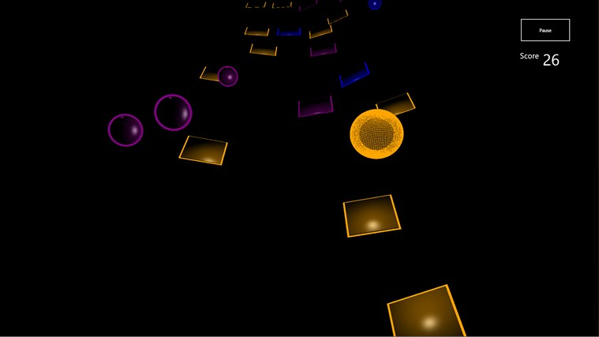



Some highlights of my university coursework projects include

* * *

##Connect 4 game server

Written in C, this server will connect to multiple concurrent clients over TCP and play a game against them. Provided good experience in unix networking and file access synchronisation between threads.

<a href="assets/connect4.zip">Source Code</a>
Can be compiled using
```make server```
and
```make client
```

* * *

##Big Data Analytics website

For the final project in an informatics class, I led a team in designing this website to produce insights into a dataset. The one I chose was the crime history of Chicago, dating from 2001 to now. We sampled the data down to 200k entries, and every time a new graphic is requested a python script generates the response and transmits a JSON payload through AJAX to update the page. It was designed to run in a RAMdisk on a decently powerful server, which gives a typical response time of 0.5-2s per graphic, however the server we have it running on for demonstration purposes now is woefully underpowered and does not have the same responsiveness. Building this whole system from scratch, excluding the simple HTML5 template the website is based on, gave many insights into modern website building and data processing.

<a href="http://128.199.102.161/Chicago/learn.html">Chicago Crime Analysis site</a>
[Chicago Crime Analysis site](128.199.102.161/Chicago/learn.html)

* * *

##"Rebound" Windows store game

For a class on graphics and their lower level function, our final project consisted of writing a game to demonstrate our knowledge, the best in the class of which were published on the Microsoft App store. We  wrote most of the game functionality in C#, with all the shaders implemented from scratch in HLSL. There are no stored assets for the game with the exception of the title font, everything else being generated dynamically as required. 

<a href="http://apps.microsoft.com/windows/en-au/app/rebound/5bb5f89f-550d-46ea-843b-d7019cc2122b">Windows Store link</a>


